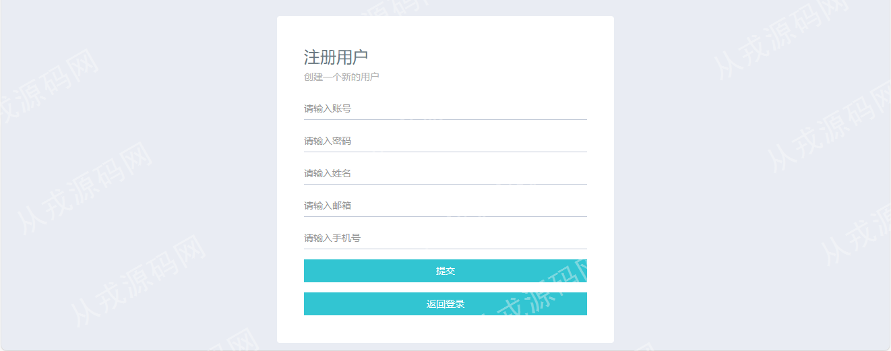
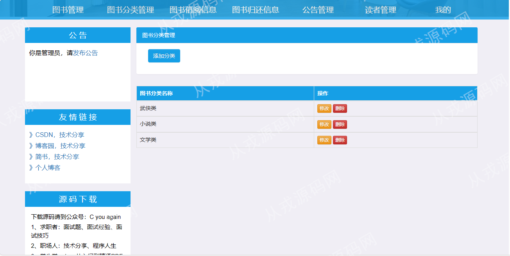
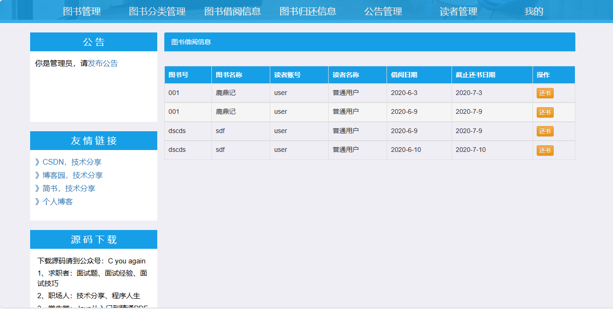
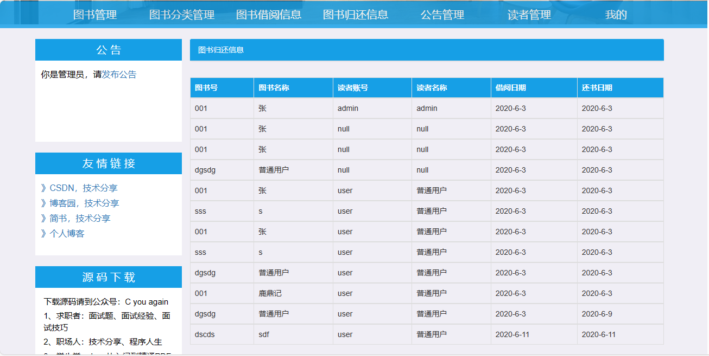
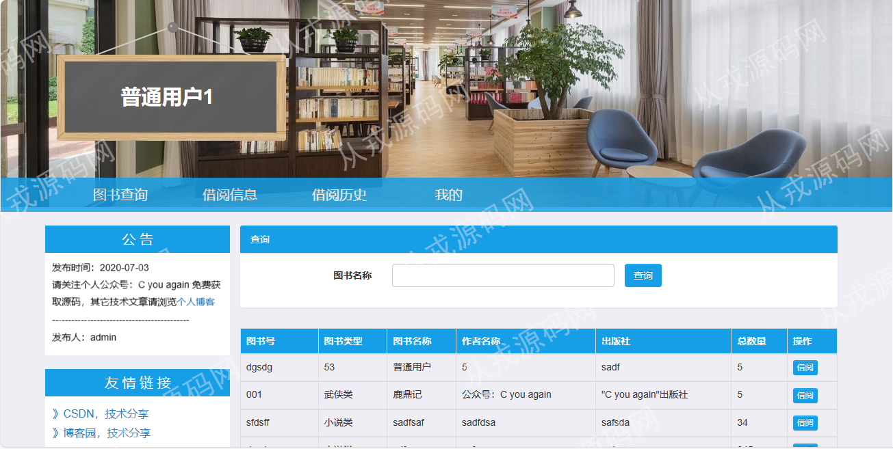
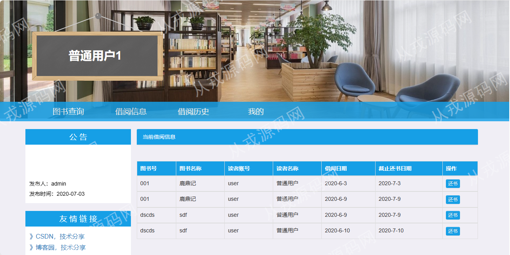

<h1 align="center">66.图书管理系统</h1>

 获取sql文件 QQ: 386869957 QQ群: 377586148 

 [推荐站点: 从戎源码网](https://armycodes.com/) 

## 简介

> 本代码来源于网络,仅供学习参考使用!
>
> 提供1.远程部署/2.修改代码/3.设计文档指导/4.框架代码讲解等服务
> 
> 登录地址：http://localhost:8080/manage_books
> 
> 管理员：admin 1
> 
> 读者：user 1
>

## 项目介绍
基于jsp+servlet的图书管理系统：前端jsp、jquery，后端 servlet、jdbc，集成图书管理、图书分类管理、图书借阅、图书归还、公告、读者等功能于一体的系统。

## 功能介绍

### 管理员

- 图书管理：图书信息的增删改查，图书名称关键词搜索
- 图书分类管理：图书分类信息的增删改查
- 图书借阅信息：读者借阅记录列表，还书操作
- 图书归还信息：归还信息列表，读者归还记录
- 公告管理：公告信息的增删改查
- 读者管理：读者信息的增删改查，密码设置用于读者登录系统时使用
- 我的：个人信息查看和修改，密码修改

### 读者

- 基本功能：登录、注册、退出、个人信息查看和修改，密码修改
- 图书查询：图书列表，关键词搜索，图书借阅操作
- 借阅信息：借阅操作后会在借阅信息记录里，读者可以自己还书操作
- 借阅历史：已经归还的图书借阅时间和归还时间，在借阅历史里可以查询

## 环境

- <b>IntelliJ IDEA 2021.3</b>

- <b>Mysql 5.7.26</b>

- <b>Tomcat 7.0.73</b>

- <b>JDK 1.8</b>

## 运行截图

